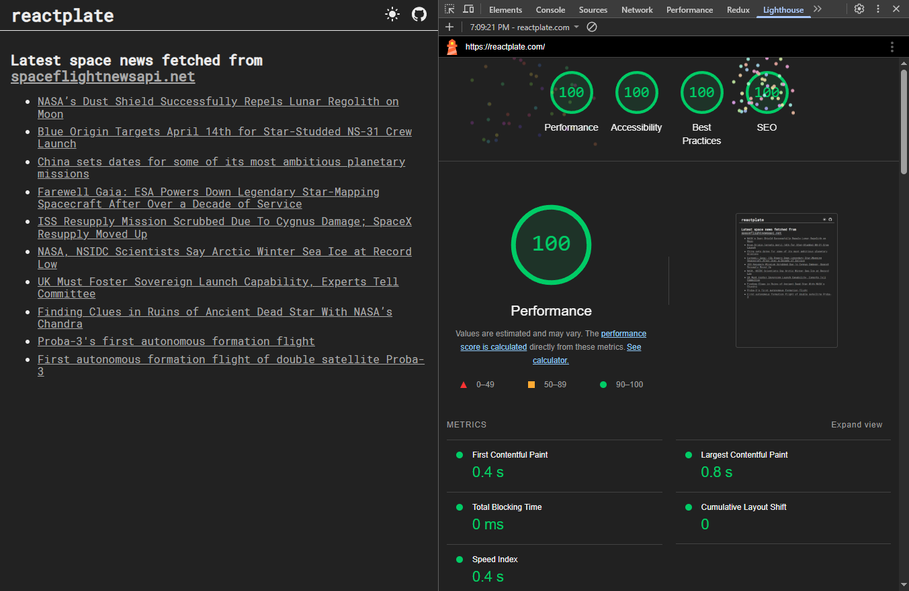
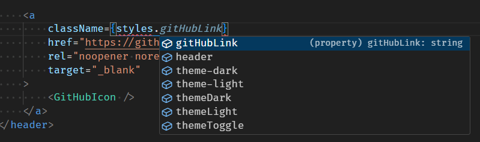
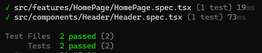
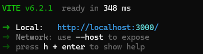
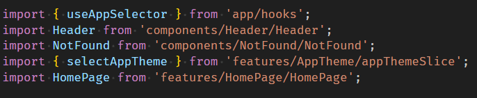
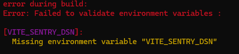

# reactplate

[](https://app.netlify.com/sites/reactplate-tenemo/deploys)

A React + modern Redux (RTK) boilerplate for a fully configured quick start with automatic formatting and linting with ESLint & Prettier.

- Strict ESLint TypeScript linting and automatic formatting with zero additional configuration needed.
- VS Code settings bundled with the boilerplate, including recommended extensions for automatic formatting - via a one-click install.
- Optional [Sentry.io](https://sentry.io) integration.
- Deployed to [Netlify](https://netlify.com) with an example catch-all redirect to always utilize react-router: [reactplate.com](https://reactplate.com)

The template follows best practices such as:

- semantic, accessible HTML,
- pre-connects to the API it uses,
- displays available system font when loading custom fonts,
- robot.txt included by default,

and many others. It scores perfect 100/100/100/100 score in Chrome Lighthouse. <br />


## Features

### React

- React 19
- React Router 7
- Catch-all 404 page
- Light/dark themes with a toggle

### State management

- Modern Redux setup
- Redux Toolkit (RTK), including a RTK Query live example
- Store setup and usage is fully & properly typed
- Example integration test using the store

### Linting & formatting

- ESLint v. 9 with ready-to-go, **strict** configuration. Notable plugins:
    - typescript-eslint for full TypeScript integration and strict typing rules
    - Prettier plugin to use prettier as formatter
    - Import & unused imports
    - React & react-hooks
    - Vitest
    - jsx-a11y (accessibility)
- VS Code settings, including ESLint set up as a formatter with Prettier integration - **formatting & quick fixes in one pass**!
- Stylelint SCSS linting
- .editorconfig for consistent code style across different editors

### Styling

- SCSS modules
- CSS variables utilized for theming with no dark/light duplication in components
- Full typing for SCSS - strict typechecking for classes! <br />
  

- Custom font
- PostCSS processing (autoprefixer, flexbugs-fixes)
- Normalize.css

### Testing

- Vitest
- React Testing Library <br />
  

Example usage with Redux and Redux Toolkit included.

### Build & development

- Vite, fast cold starts & hot 🔥 reload <br />
  
- Automatic aliases for all src/ subdirectories <br />
  
- Environment variables with validation <br />
  
- Husky pre-commit hook with linting, typechecking and tests running automatically before each commit.

## Getting started

### Prerequisites

- Node.js >=20.11.0
- NPM (comes with Node.js)

### Installation

1. Clone the repository:

    ```bash
    git clone https://github.com/Tenemo/reactplate.git
    cd reactplate
    ```

2. Install dependencies:

    ```bash
    npm install
    ```

3. Create environment variables file:
    ```bash
    cp .env.sample .env
    ```
    Add your Sentry DSN in the .env file if you want error tracking. Otherwise, feel free to add your own environment variables or remove the .env handling altogether.

### Development

1. Start the development server:

    ```bash
    npm run dev
    ```

    This will launch the application at http://localhost:3000 with hot reloading enabled.

2. Run tests:
    ```bash
    npm test  # Run tests once
    npm run test:watch # Run tests in watch mode
    npm run test:coverage # Generate test coverage report
    ```

### Building for Production

```bash
npm run build
```

To build without running linting and tests:

```bash
npm run build:skip
```

To analyze your bundle size:

```bash
npm run build:analyze
```

### VS Code

For the best development experience in VS Code install recommended VS Code extensions when prompted. All necessary configuration is already present in `.vscode/settings.json`

## License

This project is licensed under the MIT License - a permissive free software license that places almost no restrictions on what you can do with this project.
