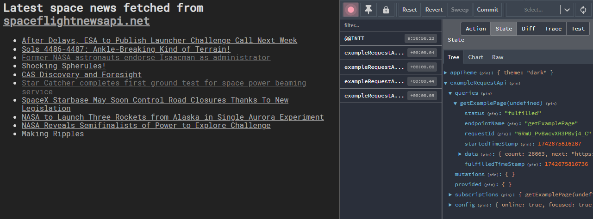

# reactplate

A React + modern Redux boilerplate for a fully configured quick start with automatic formatting and linting.

- Strict ESLint TypeScript linting and automatic formatting with zero additional configuration needed.

- VS Code settings bundled with the boilerplate, including recommended extensions for automatic formatting - via a one-click install.

- [Sentry.io](https://sentry.io) optional integration, including Redux integration - sends out the store on errors!

- Deployed to [Netlify](https://netlify.com) with an example catch-all redirect to always utilize react-router: [reactplate.com](https://reactplate.com)

## Features

### React

- React 19
- React Router 7
- Catch-all 404 page
- Light/dark themes with a toggle

### State management

- Modern Redux setup
- Redux Toolkit (RTK), including a RTK Query live example
  

- Store setup and usage is fully & properly typed
- Example integration test using the store

### Styling

- SCSS modules
- CSS variables utilized for theming with no dark/light duplication in components
- Full typing for SCSS - strict typechecking for classes!  
  

- PostCSS processing (autoprefixer, flexbugs-fixes)
- Normalize.css

### Testing

- Vitest
- React Testing Library  
  

Example usage with Redux and Redux Toolkit included.

### Build & development

- Vite, extremely fast cold starts & hot reload  
  

- React hot reload 🔥 with Vite
- Automatic aliases for all src/ subdirectories, no need to manually add new ones  
  
- Environment variables with validation  
  
- Husky pre-commit hook with linting, typechecking and tests running automatically before each commit.

### Linting & formatting

- ESLint v.9 with flat config, ready-to-go, **strict** configuration. Notable plugins:
    - typescript-eslint for full TypeScript integration and strict typing rules
    - Prettier plugin to use prettier as formatter
    - Import & unused imports
    - React & react-hooks
    - Vitest
    - jsx-a11y (accessibility)
- VS Code settings, including ESLint set up as a formatter with Prettier integration - formatting & quick fixes in one pass!
- Stylelint SCSS linting
